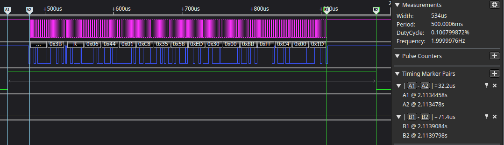
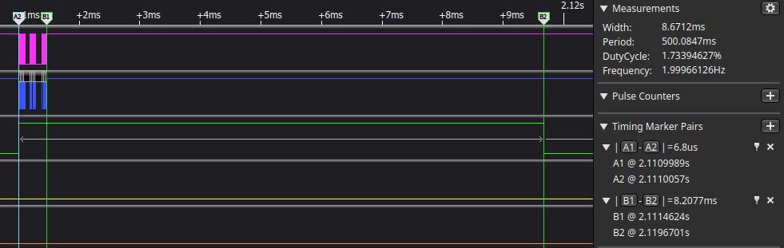

## findings of 2024-11-13
- 10kHz freeRTOS Tick frequency
- 400kHz I²C
#### poll_imu_sensor()

- 534us @ 10kHz tick frequency
- 528us @ 1kHz tick frequency

- channel 0/1 (pink, blue)= I²C bus
- channel 2 (green) = GPIO 22

#### poll_env_sensor()
- 8.6ms @ 10kHz tick frequency
- 3.0ms @ 1kHz tick frequency
I²C-part takes the smallest amount of time, calculations afterwards take multiple milliseconds (!)

- channel 0/1 (pink, blue)= I²C bus
- channel 2 (green) = GPIO 22