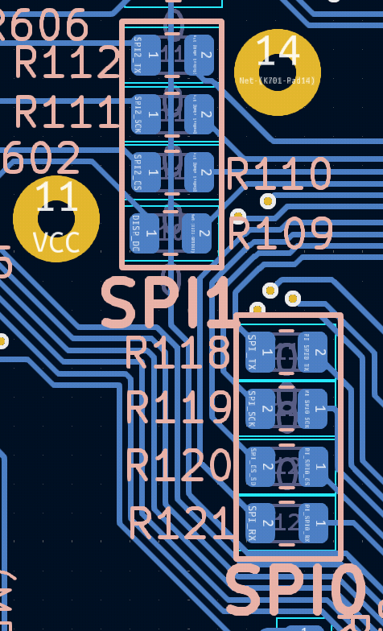

## Hardware configuration

### definitions
all designators used in this document refer to the schematic of the PCB (rev 1.1).
- microcontroller = Raspberry Pi Pico (designator U101)
- coprocessor = Raspberry Pi Zero (designator J701)

### before startup
The PCB is designed to be as flexible and robust as possible. Therefor, not all peripherals come preconfigured but SHALL be configured in hardware first.
This is accomplished by adding solder to specific positions or mounting/removing 0-Ohm-Resistors on the PCB.

You SHALL add solder joints on each of those Jumper-Pads listed in the table below:
| name | description |
|--|--|
| JP201 | configure I²C-address of BME688 sensor (U201):  1+2 for Address 0x77.   2+3 for Address 0x76. |
| JP202 | configure I²C-address of BME280 sensor (U202):  1+2 for Address 0x77.   2+3 for Address 0x76. |
| JP203 | configure I²C-address of MPU-6050 sensor (Breakout XX201):  1+2 = Address pulled to GND  1+3: Address pulled to 3V3. |

During design, the connection of the GND-Pin in U401 (SD-Card-Breakout) got lost. To fix this, you SHALL connect Pin 1 of U401 to any other GND-Pin on the PCB, e.g. Pin 13 of the microcontroller right below. It is suggested, to add the bonding-wire to the bottom-layer of the PCB but you MAY connect it on the top side as well.

TODO: refer to the boost converter-section for boost-converter and battery information

### general hardware information

#### GPS
The PCB can handle two different options for GPS. Preferably populate the U302-footprint with a L86-M33 module. Alternatively, use the pinout header marked with U301 in the center right of the PCB to connect a GPS-breakout-board. Both options SHOULD be interchangable software-wise as both chips support the wide spread NMEA-protocol.

If you are using the L86-M33-module (U302 populated) you can access the `RESET` and `FORCE_ON`-pins by adding some wires to the test points `TP301` and/or `TP302`. 

#### raspberry pi zero (coprocessor)
Since the microcontroller on the pi pico MAY not have the requirement power to handle all the post-processing needed for analysis, the pi zero can be powered on. This is accomplished by powering on a relay (designator K701) which applies voltage to the board. The software running on the pi SHALL configure this pin (`GPIO5` on the Pi Zero) as an **output**. It SHOULD be set to HIGH when the boot is finished and set to LOW when the Pi Zero can be powered down again.

The coprocessor board SHOULD be powered on only when necessary to minimize the energy consumption.

#### HMI (human-machine-interfaces)

There are multiple ways the board can communicate to the user. One rudimentary option to communicate are the three LEDs at the top right of the PCB. Left to those, there is a DIP-Switch. The four right switches MAY be used to set the campaign ID. If a switch is in Position A (see the markings on the PCB to the right of the casing), it resembles a binary "1", Position B a binary "0". (TODO: to be verified/implemented in software). To save on IO-Pins on the microcontroller, the four switches are connected through a voltage divider-networks with resistors in the ratio 1:2:4:8 to an analog pin on the pi zero.

The LEDs are used for 
- D801: to be defined
- D802: to be defined
- D803: to be defined

One of the LEDs may be replaced by a buzzer. This can be used to help synchronizing video footage to the data recorded.

The Pin-Header U601 is designed for an eInk-Display. The microcontroller communicates with it using the second SPI-bus (called SPI1) (see section "data buses" down below for further details). 

#### data buses

|bus name |acces it via…| used for… |
|--|--|--|
| UART0 | J102 | serial communication, debugging |
| UART1 | J101 | GPS-Chip|
| I²C 0 | J103 | Gyro/Acceleration, Temperature/Environment-Sensors|
| SPI0  | see figure below | SD-Card |
| SPI1  | see figure below | e-Ink-Display |

The wires used for SPI communication are located and marked on the backside of the PCB.

All devices using the I²C-Bus can be removed from the I²C-Master by removing their Pair of 0-Ohm-Resistors. All of those resistors are positioned at the bottom left corner on the backside of the PCB.

TODO: Table of Resistor-Names and their corresponding I²C-Devices

#### power management

TODO:
- [ ] table of power rails, how to configure on PCB
- [ ] document power draw of the components when finished
- [ ] boost converter thingiy

#### SIM-board
For future expansion, a breakout for the SIM-module was added. Right now, only all GND-Pins are connected to the main ground plane. There are neither connections to power the SIM-module, nor to communicate with it. Please have a look at the schematic and the datasheet of the chip where to add connections. All pins are broken out to three connectors (J901, J902, J903).

#### internet connection
there WILL be at least three viable options to upload data to or recieve from the internet:
- use the WiFi-Chip on board of the microcontroller.
- use a LTE-Stick or similar plugged into the coprocessor.
- use a LTE-Breakout connected to one of the UART-buses

#### raspberry pi pico

| Bus Name      | Bus Property | GPIO-Pin |
|---------------|--------------|----------|
| UART0 (debug) | TX           | 0        |
|               | RX           | 1        |
| UART1 (GPS)   | TX           | 8        |
|               | RX           | 9        |
| I²C 0 (Sensor)| SDA          | 6        |
|               | SCL          | 7        |
|SPI 0 (SD-Card)| TX           | 19       |
|               | RX           | 16       |
|               | SCK          | 18       |
|               | CS           | 17       |
|SPI 1 (Display)| TX           | 15       |
|               | RX (DC-Pin)  | 12       |
|               | SCK          | 14       |
|               | CS           | 13       |
| Display       | RST (output) | 11 (output) |
|               | Busy         | 10 (input) |
| LED           | D801 / left  | 22       |
|               | D802 / center| 21       |
|               | D803 / right | 20       |
| HMI           | Campaign DIP | 27 / ADC1 (input) |
| PowerSwitch   | Bus 1        | 2 (output) |
|               | Bus 2        | 3 (output) |
|               | Bus 3        | 4 (output) |
|               | Bus 4        | 5 (output) |
| PiZero        | CPU ready    | 28 / ADC2 (input) |
| Battery       | Battery voltage | 26 / ADC0 (input) |